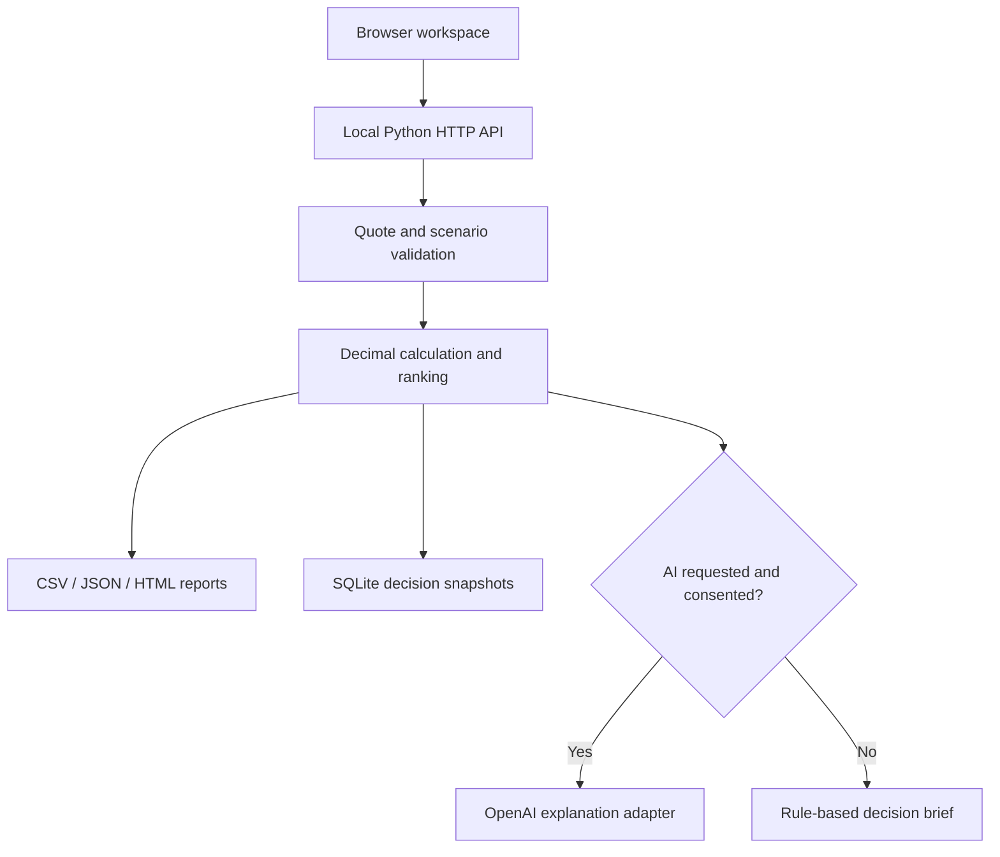

# AI Procurement Assistant
### Supplier Comparison & Cost Analysis

An explainable sourcing workspace that turns supplier quotes into a defensible buying decision. Compare landed cost, delivery feasibility, quality and on-time-in-full performance; test changes before committing to a supplier.

**Portfolio project by Witsawawit Srikhummaun** · Python · SQL / SQLite · JavaScript · optional OpenAI API

> All included suppliers, quotes, performance data and exchange rates are synthetic. This project demonstrates procurement decision support; it does not claim realized business savings or production deployment.

**Four working views:** Supplier comparison · Scenario lab · Saved decisions · Methodology

## Start in one command

Requires **Python 3.10 or newer**. No pip installation, Node build or API key is needed for the core application.

```bash
python app.py --open
```

Windows alternative: double-click **START_WINDOWS.bat**, or run `py -3 app.py --open`.

Open **http://127.0.0.1:8765**. To use another port: `python app.py --port 8877 --open`.

[คู่มือภาษาไทย](docs/QUICKSTART_TH.md) · [Calculation methodology](docs/METHODOLOGY.md) · [Data dictionary](docs/DATA_DICTIONARY.md) · [Interview guide](docs/PORTFOLIO.md)

## The business problem

The cheapest quoted unit price may not produce the best order. Minimum order quantities, pack sizes, shipment charges, currency exposure and delivery constraints can change the outcome. Buyers also need to explain why a supplier was selected.

This application makes those assumptions visible and repeatable:

- **Landed cost in THB:** manual FX, order rounding, incremental freight and insurance, modeled duty, other costs and recoverable/non-recoverable VAT.
- **Feasibility before ranking:** quote validity, capacity, delivery deadline, minimum quality and minimum OTIF.
- **Transparent weighted scores:** configurable cost, lead-time, quality and reliability priorities, totaling 100%.
- **Fair product grouping:** compares offers for one SKU at a time; technical equivalence remains a buyer validation step.
- **Scenario analysis:** demand ±25%, foreign FX +10%, deadline −7 days and cost-first weights.
- **Local decision records:** SQLite snapshots of quotes, assumptions and results with SHA-256 integrity checks.
- **Practical outputs:** formula-safe comparison CSV, calculation JSON and a printable HTML decision report.
- **Optional AI explanation:** an OpenAI Responses API adapter explains computed evidence after explicit consent. Ranking and arithmetic remain deterministic.

## Two clearly separated modes

| Mode | What it does | Requirements |
|---|---|---|
| Offline decision support | Calculates costs, ranks eligible offers, builds a rule-based brief and reports | Python only |
| AI explanation | Generates a narrative and negotiation questions from the computed analysis | Your OpenAI API key, a model available to your account, network access and API billing |

The offline brief is **not** presented as an LLM. The AI never changes the calculation results and cannot issue a purchase order. Its text can still be incorrect and must be reviewed against the numbers.

### Optional AI setup

Choose a text model that supports the Responses API and is available to your OpenAI project. This repository deliberately does not hardcode a model name or imply that a ChatGPT subscription includes API usage.

PowerShell:

```powershell
$env:OPENAI_API_KEY = "YOUR_API_KEY"
$env:OPENAI_MODEL = "YOUR_AVAILABLE_MODEL_ID"
py -3 app.py --open
```

macOS / Linux:

```bash
export OPENAI_API_KEY="YOUR_API_KEY"
export OPENAI_MODEL="YOUR_AVAILABLE_MODEL_ID"
python3 app.py --open
```

Environment variables are read at runtime. `.env.example` is documentation only; `.env` files are not automatically loaded. **Never put a real key in a tracked file, screenshot, browser field or GitHub commit.**

After comparison, enter a question (Thai or English), check the data-sharing consent box and choose **Generate AI explanation**. This sends the computed analysis, supplier fields and question to OpenAI. The request uses `store: false`; this setting is not a promise of zero retention under all API data policies. Failed requests leave the offline result intact.

Official implementation reference: [Responses API migration guide](https://developers.openai.com/api/docs/guides/migrate-to-responses).

## Suggested demo (3 minutes)

1. Start with **BRG-6205**, demand **1,000**, deadline **21 days**.
2. Read the recommendation and compare it with the cheapest eligible quote. Inspect score components to explain the trade-off.
3. Set all weight to cost and run comparison. Observe how priorities change the decision.
4. Set a **1-day** deadline. The result must be **No award recommended**.
5. Restore the deadline and run the Scenario lab. Compare winners under demand, FX and deadline changes.
6. Save a decision, reload it, and export its CSV or printable report.

For the sample local offer Q001, demand 1,000 gives a modeled landed cost of **THB 166,150.00** excluding recoverable VAT, and **THB 177,756.00** cash outlay. The included tests independently verify this example.

## Import your own quotes

Use **CSV template** in the app or edit [data/sample_quotes.csv](data/sample_quotes.csv). Keep column names and order unchanged. Import supports up to 50 quotes and a 500 KB UTF-8 CSV. A BOM is accepted.

Import validates the entire file before replacing the current workspace. Quotes can also be added or edited in the interface. Only **Save decision** persists a snapshot; unsaved workspace changes are lost when the page reloads.

Check [the data dictionary](docs/DATA_DICTIONARY.md) before using real data. FX and tax rates are manual assumptions, not current market feeds or legal guidance.

## Architecture



| Path | Responsibility |
|---|---|
| `app.py` | Loopback-only HTTP server, route handlers, request limits and CSRF checks |
| `procurement/engine.py` | Validation, Decimal money arithmetic, feasibility, scoring, sensitivity |
| `procurement/reports.py` | Escaped HTML, formula-safe CSV, decision reports |
| `procurement/storage.py` | Parameterized SQLite queries and snapshot integrity checks |
| `procurement/ai.py` | Optional server-side OpenAI adapter; sanitized failure handling |
| `web/` | Responsive, dependency-free browser UI |
| `data/` | Synthetic sample quotes |
| `tests/` | Calculation, API, export, persistence and mocked AI checks |
| `.github/workflows/ci.yml` | Python test matrix on Windows and Linux |

## Test

```bash
python -m unittest discover -v
```

Tests cover hand-calculated local/import costs, VAT treatment, MOQ and pack rounding, capacity after rounding, expiry, SKU isolation, weighting, deterministic ties, no-award cases, invalid inputs, CSV/HTML safety, CSRF/origin checks, exports, snapshot integrity and mocked AI request/response behavior.

The AI adapter is tested with mocked responses and errors. **No paid live API call was made during initial validation.** See [validation notes](docs/VALIDATION.md) for completed checks and the browser-validation limitation. CI runs after the repository is uploaded and Actions is enabled; a local test pass is not a claim that CI has already run.

## Data and security scope

- Runs on `127.0.0.1` only. Intended for one local user, not public multi-user hosting.
- No runtime third-party JavaScript, fonts, analytics or CDN dependencies.
- Static files are allowlisted; source files, keys and SQLite storage are not served.
- POST requests require a per-process CSRF token and allowed origin/host; no permissive CORS.
- Secrets stay in server environment variables. API error bodies are not reflected to the browser.
- SQL writes use parameterized queries; exported HTML escapes user input; CSV strings are protected against common spreadsheet formula injection.
- Saved records are in `runtime/analyses.sqlite3` (ignored by Git). Set `PROCUREMENT_DB` to change the location. Back up this file yourself if needed.
- A SHA-256 checksum detects accidental snapshot changes; someone with database write access could replace both the content and checksum. This is **not** a tamper-proof audit log.
- No user authentication, TLS termination, supplier verification, ERP integration or automatic purchasing is provided. Do not expose this server to the internet as-is.

## GitHub repository

Repository: [WitsawawitS/ai-procurement-assistant](https://github.com/WitsawawitS/ai-procurement-assistant).

The repository is initially private. Only authorized viewers can access it. Before sharing it with recruiters, explicitly choose whether to make it public or grant access.

After downloading or cloning the repository, run `python app.py --open` from the project directory. GitHub stores the source; the Python application does **not** run on GitHub Pages. Public web deployment requires a separately hosted backend and authentication/security work.

The optional `scripts/publish_github.py` helper is intended only for initial publication to an absent repository. It stops when a repository or origin remote already exists and defaults to private visibility. It is not needed for this published repository.

## Project ownership and learning

This is an AI-assisted portfolio implementation designed around procurement and sourcing workflows. The owner should be able to explain the assumptions, trade-offs and code before presenting it as a work sample. See [PORTFOLIO.md](docs/PORTFOLIO.md) for an honest project description and interview questions.

Licensed under the [MIT License](LICENSE).
